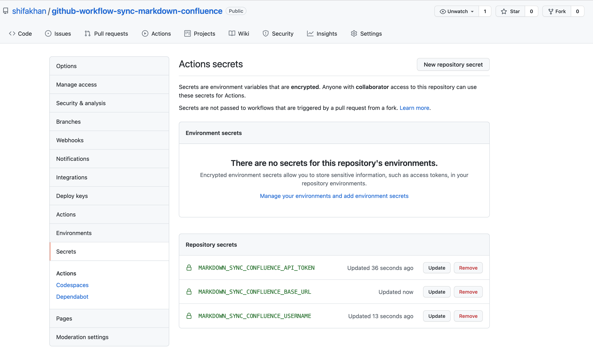
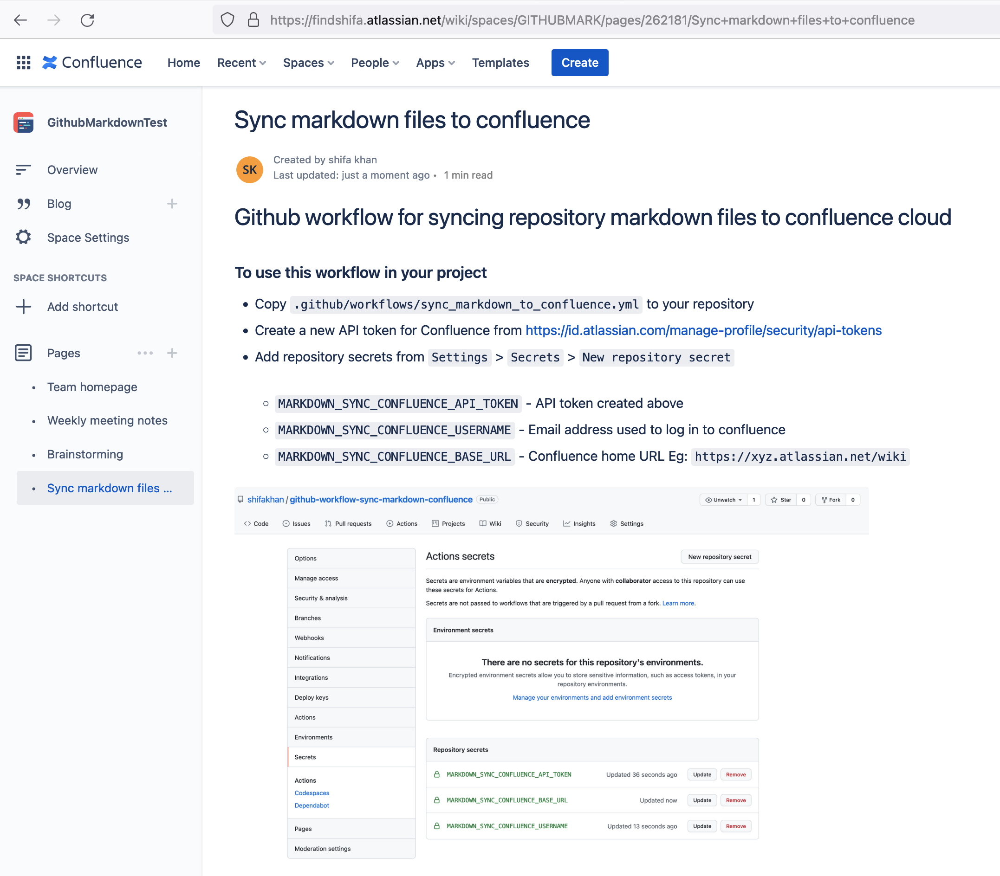

<!-- Space: GITHUBMARK -->
<!-- Title: Sync markdown files to confluence -->
<!-- Attachment: repository_secrets.png -->
<!-- Attachment: confluence_page_readme.png -->

# Github workflow for syncing repository markdown files to confluence cloud

### To use this workflow in your project

- Copy `.github/workflows/sync_markdown_to_confluence.yml` to your repository
- Create a new API token for Confluence from https://id.atlassian.com/manage-profile/security/api-tokens
- Add repository secrets from `Settings` > `Secrets` > `New repository secret`
  - `MARKDOWN_SYNC_CONFLUENCE_API_TOKEN` - API token created above 
  - `MARKDOWN_SYNC_CONFLUENCE_USERNAME` - Email address used to log in to confluence
  - `MARKDOWN_SYNC_CONFLUENCE_BASE_URL` - Confluence home URL Eg: `https://xyz.atlassian.net/wiki`



### Note

- This workflow uses https://github.com/kovetskiy/mark to convert markdown files to confluence content. As described in the readme of this tool, your markdown files will need extra markup to define where to copy the file in confluence. Files without the minimum markup (Space, Title) will be ignored. Example - 
```
<!-- Space: SPACE_KEY -->
<!-- Title: Sample Title -->

## Markdown content
```
- This workflow only runs when code is pushed to `master` or `main` branch and a markdown file was modified in the code changes.  
- This workflow only syncs the  markdown files `docs` folder and subfolders iin addition to `README.md`. To sync all `.md` files change the value of `FILES_CHANGED_IN_COMMIT` to `$(git log -m -1 --name-only --pretty="format:" ${{ github.sha }} | grep '.*\.md$')`
- Image attachments work correctly if they are in the same directory as the markdown file. 

#### Sample of this README.md doc synced to confluence

